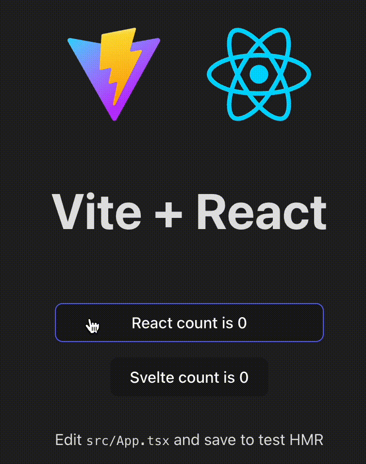
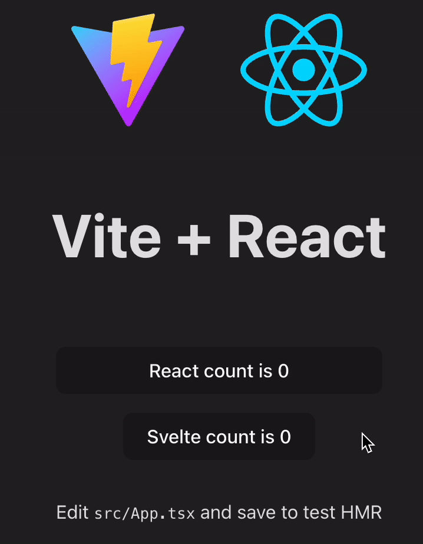
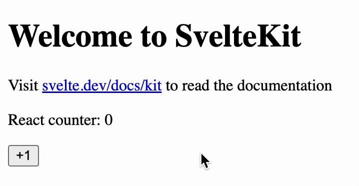

# Incremental Migration of a Production React App to Svelte 5: A Practical Guide

Rewriting a production app is risky for any team, but especially for a small startup like ours with limited engineering resources. Yet sometimes, the right opportunity makes it worth considering.

For us, that moment came when Svelte 5's release candidate coincided with our plans to rebuild our platform for enterprise customers. Our existing React application, particularly its graphic editor component, was struggling with performance issues that were becoming increasingly difficult to manage. This convergence presented an opportunity: could migrating to Svelte help us address both our immediate performance bottlenecks and our long-term platform goals?

Our small team took a cautious approach. First, we added a Svelte component to our React app. Then we rebuilt an entire page. Finally, we set up a SvelteKit app that could use our existing React components. Each step worked better than expected and delivered real improvements.

Hi, I'm David 👋, an engineering lead at [dipp](https://www.withdipp.com/en-us/), where we help brands automate digital content creation. Our platform simplifies design tasks and fosters team collaboration – a mission directly impacted by the performance and maintainability of our tools.

In this guide, I'll share the practical lessons from our journey: how we integrated React and Svelte 5, the challenges we encountered, and the benefits that justified the effort. If your team is facing similar hurdles with a complex React application, this provides a roadmap for migrating incrementally without disrupting your product or overwhelming your team.

Skip to [part two](#part-2-migrate) for the technical details.


## Table of Contents

- [Incremental Migration of a Production React App to Svelte 5: A Practical Guide](#incremental-migration-of-a-production-react-app-to-svelte-5-a-practical-guide)
  - [Table of Contents](#table-of-contents)
  - [Part 1: Decision-Making](#part-1-decision-making)
    - [The Business Reality](#the-business-reality)
    - [Our Specific Challenges](#our-specific-challenges)
      - [Why React Wasn't Working for Our Graphic Editor](#why-react-wasnt-working-for-our-graphic-editor)
    - [Start with Small Bets: From Components to Routes](#start-with-small-bets-from-components-to-routes)
      - [Begin with a Self-Contained Component](#begin-with-a-self-contained-component)
      - [Validate the Integration Approach](#validate-the-integration-approach)
      - [Scale to a Full Feature](#scale-to-a-full-feature)
      - [Build Team Confidence](#build-team-confidence)
    - [From Technical Success to Organizational Buy-in](#from-technical-success-to-organizational-buy-in)
    - [Not Everything is a Win](#not-everything-is-a-win)
    - [Beyond Migration: The Human Factor](#beyond-migration-the-human-factor)
      - [Learning Curves Stack Quickly](#learning-curves-stack-quickly)
      - [Developer Experience Isn't Universal](#developer-experience-isnt-universal)
    - [Key Takeaways](#key-takeaways)
  - [Part 2: Migrate](#part-2-migrate)
    - [Prerequisites](#prerequisites)
    - [How to render Svelte 5 components in React](#how-to-render-svelte-5-components-in-react)
    - [How to render React components in SvelteKit](#how-to-render-react-components-in-sveltekit)
    - [Integration Strategy Summary](#integration-strategy-summary)
  - [Conclusion: Practical Migration in the Real World](#conclusion-practical-migration-in-the-real-world)


## Part 1: Decision-Making

"Do not rewrite your product!" is advice most tech leaders have heard—and for good reason. Rewrites are risky, expensive, and often fail to deliver on their promises.

But sometimes, the cost of staying with your current technology exceeds the risk of changing. This was our situation with a legacy React application that was becoming increasingly difficult to maintain and extend.

### The Business Reality

Every technology decision ultimately comes down to business value. Whether you're at a startup or an enterprise, you need to justify the investment of time and resources.

The typical rewrite conversation often goes something like this:

"We need to rewrite our app. We have years of tech debt, performance issues, and our development velocity is suffering."

"How long will it take?"

"About 6 months."

"Can you do it in 3 months while still shipping new features and fixing bugs?"

The answer is almost always no. Complete rewrites rarely succeed because they compete with ongoing business needs. Instead, we needed an incremental approach that would allow us to migrate gradually while continuing to deliver value.

### Our Specific Challenges

In mid-2024, we began a gradual migration from our legacy React app to Svelte, with the goal of releasing a new version in Q2 2025. We faced three main challenges:

1. **Technical debt**: More than 80% of our React SPA was written in JavaScript without tests or documentation, making changes increasingly risky.

2. **Overly complex architecture**: Previous developers had prioritized DRY principles to the extreme, creating components that were difficult to understand and maintain.

3. **Performance bottlenecks**: Our graphic editor (similar to Figma or Canva) suffered from React's rendering model, causing poor performance with complex SVG elements.

While we could address the first two issues through refactoring, the performance problems were more fundamental to React's architecture, especially for our graphic-intensive application that required complex text formatting with different fonts, sizes, colors, and spacing within a single text box.

#### Why React Wasn't Working for Our Graphic Editor

React is excellent for many applications, but it presented specific challenges for our graphic editor:

1. **Performance with complex visuals**: When users edit designs with hundreds of SVG elements, React's approach to comparing the entire component tree became noticeably slow, especially during real-time editing.

2. **Too many unnecessary updates**: A particularly painful example was text editing. When a user changed a single character in a text box, React would re-render not just that text element but often dozens of unrelated components. Despite our team spending weeks implementing memoization and careful prop management, we couldn't eliminate the stuttering.

3. **Delayed visual feedback**: React's batched state updates sometimes created noticeable delays in visual feedback, which is particularly problematic in a design tool where users expect immediate, pixel-perfect control.

After years of optimization attempts, we realized we needed a framework with fine-grained reactivity—one that could update only what changed without re-evaluating entire component trees. Svelte 5's runes system offered exactly this capability.

With this understanding, we began to explore how to integrate Svelte 5 into our existing React application, starting with small, low-risk experiments.

### Start with Small Bets: From Components to Routes

#### Begin with a Self-Contained Component

To ease back into Svelte (my last experience was with Svelte 3, pre-SvelteKit), I began by building a simple modal component. Modals are perfect test cases because they:
- Are self-contained with clear boundaries
- Require state management for open/close logic
- Handle events for user interactions
- Need styling that doesn't leak to other components

#### Validate the Integration Approach

My goal was to answer two critical questions:
1. How well does Svelte 5's new runes-based syntax work in practice?
2. Can Svelte components be seamlessly integrated into our existing React app?

(If you want to jump straight to the integration details, see [React + Svelte 5 components](#prerequisites).)

#### Scale to a Full Feature

Once the modal was working smoothly, I migrated an entire route to Svelte. This larger test revealed how Svelte's approach simplified our codebase with intuitive state management through `$state` and `$derived`, more natural component composition, and significantly less boilerplate for event handling.

#### Build Team Confidence

While building these components, I created documentation and examples to introduce the team to Svelte 5. To make the case compelling, I highlighted:

- **Performance benefits**: Svelte's compiler-first approach generates optimized JavaScript with minimal runtime overhead
- **Developer experience**: Less boilerplate and more intuitive reactivity with runes
- **Mental model shift**: In React, we constantly think about preventing unnecessary re-renders; in Svelte 5, the fine-grained reactivity system handles this automatically

This shift is especially valuable for our graphic editor, where precise control over rendering and performance directly impacts user experience. When team members saw how much cleaner our code became and how performance improved in specific interactions, they became more open to broader adoption.

### From Technical Success to Organizational Buy-in

Successfully migrating a component or even an entire route is just the beginning. Technical feasibility alone won't convince an organization to embrace change. We needed to demonstrate concrete business value to gain broader support.

After our initial successes, we focused on measuring and communicating three key areas of improvement:

- **Code simplicity**: Fewer lines of code, built-in state management, and simpler component architecture reduced our maintenance burden
- **Development speed**: Features that took days in React could be built in hours with Svelte, with faster feedback loops and more intuitive debugging
- **User experience**: Smaller bundles loaded faster and interactions became more responsive in the components we migrated

For each area, we collected metrics comparing our Svelte implementation against the React version:

- Bundle size reduced by 23%. (8.5MB to 6.5 MB)
- Development time cut more than half. (digital asset management)
- Lighthouse score improves from 56 to 72. (both are not optimized)

> While these metrics show technical improvements, they don't necessarily translate directly to business value. Focus instead on measuring and communicating user-facing benefits like improved load times and interaction responsiveness that impact the customer experience.

With these promising results, we've gained support for continuing our migration. The graphic editor, our most complex component and the one that initially motivated this change—remains the final piece to be migrated. Based on our proof of concept work, we expect the fine-grained reactivity of Svelte to significantly improve its performance.

### Not Everything is a Win

While the transition was smoother than expected, we faced two main challenges that are worth noting.

First, the Svelte 5 ecosystem isn't fully mature yet. Many library authors were waiting for the release candidate before adding support, which is understandable but limiting. We often had to mix older store-based patterns with the newer runes approach, which sometimes confused team members about which pattern to use when.

Second, we lacked established best practices. As early adopters, we found ourselves creating patterns through trial and error rather than following well-worn paths. This meant occasional backtracking when our first approach didn't scale well.

Neither of these issues are deal-breakers—they're temporary growing pains that will resolve as the ecosystem matures. The benefits we gained still outweighed these challenges.

> A key pattern we developed combines Svelte 5's runes with a state management class, integrating `FiniteStateMachine`, `watch`, and `resource` from the [`runed`](https://runed.dev/docs) library for robust state handling:
> 
> ```ts
> // my-state.svelte.ts
> import { FiniteStateMachine, watch, resource, type ResourceReturn } from 'runed'
>
> type MyStates = "on" | "off";
> type MyEvents = "toggle";
>
> export class MyState extends FiniteStateMachine<MyStates, MyEvents> {
>   readonly myResource: ResourceReturn  
>   constructor(getter: () => string) {
>     super("off", {
>	      off: {
>		      toggle: () => {
>			      f.debounce(5000, "toggle");
>			      return "on";
>		      }
>	      },
>	      on: {
>		      toggle: "off"
>	      }
>     })
>     // Pass the getter to watch to rerun side effects
>     watch(getter, () => {})
>     // or use resource to rerun fetcher
>     this.myResource = resource(getter. async () => {})
>     // NOTE: We prefer to use watch orver $effect because for most of the time we need to use untrack for other reactive value in $effect
>   }
> }
>
> const MY_STATE_KEY = Symbol('my-state');
>
> export function setMyState(getter: () => string) {
>   setContext(MY_STATE_KEY, new MyState(getter));
> }
>
> export function getMyState() {
>   return getContext<MyState>(MY_STATE_KEY);
> }
> ```
> Ref: [Svelte 5's Secret Weapon: Classes + Context
](https://www.youtube.com/watch?v=e1vlC31Sh34) by the great [@huntabyte](https://x.com/huntabyte)

### Beyond Migration: The Human Factor

Switching technologies isn't just about code—it's about people and processes too. This transition taught us several important lessons about managing change.

#### Learning Curves Stack Quickly

Learning Svelte 5 alone would have been manageable, but tackling both Svelte and SvelteKit simultaneously proved challenging. The team needed time to absorb one set of concepts before adding another. We found it more effective to master the component model first, then gradually introduce routing and other framework features.

Key resources that helped our team quickly understand Svelte 5:
- [Official tutorials](https://svelte.dev/tutorial/svelte/welcome-to-svelte)
- [Svelte 5 Basics - Complete Svelte 5 Course for Beginners](https://www.youtube.com/watch?v=8DQailPy3q8) by Syntax.fm
- [Don't Sleep on Svelte 5](https://www.youtube.com/watch?v=DgNWssn2vpc) by [@huntabyte](https://x.com/huntabyte)
- [The Svelte 5 Reactivity Guide](https://youtu.be/tErKyuUTzsM?si=L1MN0Cd5XFm8G_p3) by [Joy of Code]
(https://x.com/joyofcodedev)
- [Component Party](https://component-party.dev/) - Side-by-side React vs Svelte component comparisons

#### Developer Experience Isn't Universal

Another important lesson emerged as we expanded our adoption efforts. What felt intuitive to me wasn't always obvious to others. Team members with years of React experience had to unlearn certain habits and ways of thinking. The mental shift from React's component re-rendering approach to Svelte's fine-grained reactivity required patience and practice.

This adjustment period affected productivity temporarily, but the investment paid off as team members began to appreciate Svelte's more direct approach to UI updates.

### Key Takeaways

From our experience, here are the most useful lessons for teams considering a similar transition:

1. Be realistic about both benefits and challenges. The Svelte ecosystem is still developing, which means you'll sometimes need to create solutions that React developers take for granted.

2. Give your team adequate time to adjust. The shift in thinking from React to Svelte is significant and can't be rushed.

3. Introduce changes incrementally. We focused on Svelte components first, then gradually added more complex patterns and framework features.

4. Start with isolated, non-critical components to build confidence before tackling core features.

5. Create clear guidelines about when to use which pattern, especially when mixing older approaches with newer ones.

6. Balance the tradeoffs: React's ecosystem offers many libraries but can lead to complexity, while Svelte often requires building custom solutions that are simpler and more tailored to your needs.

## Part 2: Migrate

Now that we've covered why we decided to migrate and the strategic approach we took, let's dive into the technical details of how we actually implemented the integration between React and Svelte. The following patterns and code examples represent the practical solutions we developed during our migration journey.

This section provides practical steps for integrating Svelte 5 components into a React application and vice versa. These patterns enabled our team to migrate incrementally without disrupting the existing application.

### Prerequisites

Before starting the integration, you'll need a basic understanding of both React and Svelte 5. The examples below assume you're working in a monorepo structure, but the same principles apply to separate repositories.

### How to render Svelte 5 components in React

Let's start by adding Svelte components to an existing React application. This approach allows you to gradually introduce Svelte while maintaining your current React codebase.

Run `pnpm create vite react-vite --template react-ts` to create a new React app in this monorepo.

1. Install `svelte` & `@sveltejs/vite-plugin-svelte`:
```bash
pnpm add -D svelte @sveltejs/vite-plugin-svelte
```

2. Add `@sveltejs/vite-plugin-svelte` to `vite.config.ts`:
```ts
import { defineConfig } from 'vite'
import react from '@vitejs/plugin-react'
import { svelte } from '@sveltejs/vite-plugin-svelte'

// https://vite.dev/config/
export default defineConfig({
  plugins: [react(), svelte()]
})
```

3. Create a `useSvelte.tsx` hook:
```tsx
import { useLayoutEffect, useRef } from 'react'
import { mount } from 'svelte'

type Component = Parameters<typeof mount>[0]
type Props = Parameters<typeof mount>[1]['props']

/** A wrapper for Svelte component */
export default function useSvelte(Component: Component) {
  const svelteRef = useRef<HTMLDivElement>(null)

  return (props: Props) => {
    useLayoutEffect(() => {
      while (svelteRef.current?.firstChild) {
        svelteRef.current?.firstChild?.remove()
      }
      mount(Component, {
        target: svelteRef.current as unknown as Document,
        props
      })
    }, [])

    return <div style={{ height: '100%', width: '100%' }} ref={svelteRef}></div>
  }
}
```

4. Create a Svelte component (in the React app) and use `useSvelte`:
```svelte
// src/lib/components/counter/counter.svelte
<script lang="ts">
  let { initCount = 0 }: { initCount: number } = $props()
  let counter = $state(initCount)
</script>

<button onclick={() => (counter += 1)}>
  Svelte count is {counter}
</button>

```
```tsx
// src/lib/components/counter/svelte-counter.tsx
import useSvelte from '../../hooks/useSvelte'
import Counter from './counter.svelte'

export default function SvelteCounter({ initCount }: { initCount: number }) {
  const SvelteCounter = useSvelte(Counter)

  return <SvelteCounter initCount={initCount} />
}
```

5. Add to `App.tsx` and test it:
```tsx
import { useState } from 'react'
import { SvelteCounter } from './lib/components/counter'

function App() {
  const [count, setCount] = useState(0)

  return (
    <>
      <button onClick={() => setCount((count) => count + 1)}>
        React count is {count}
      </button>
      <SvelteCounter initCount={0} />
    </>
  )
}

export default App
```

You may have noticed an issue with this approach.

Due to React's rerendering behavior, the Svelte component gets remounted each time, which is not the desired outcome.

To resolve this, let's add `memo` to `SvelteCounter`:
```tsx
// src/lib/components/counter/svelte-counter.tsx
import { memo } from 'react'
import useSvelte from '../../hooks/useSvelte'
import Counter from './counter.svelte'

export default memo(function SvelteCounter({ initCount }: { initCount: number }) {
  const SvelteCounter = useSvelte(Counter)

  return <SvelteCounter initCount={initCount} />
})
```
It should work as expected now:


> **Note**: As a best practice, only pass props that don't change frequently to Svelte components, such as global variables like i18n, theme configurations, etc.

## How to render React components in SvelteKit

After successfully integrating Svelte components into our React application, we were ready for the next phase of our migration. While adding individual Svelte components was valuable, we wanted to start building new features directly in SvelteKit. However, we couldn't afford to rewrite all our existing React components at once.

Once you've established a pattern for using Svelte components in React, you might want to start building new features directly in SvelteKit while still leveraging your existing React components. This approach allows you to:

1. Create new routes and features in SvelteKit
2. Reuse existing React components without rewriting them
3. Gradually shift your development to Svelte while maintaining access to your React component library

In our migration, we moved shared React components to a separate package within our monorepo, making them available to both applications. Here's how to set it up:

1. First, we need to package the shared React components to make them available to both applications.
> Please find the source code in `packages/react-components`. We use nodemon to watch the source files and rebuild the package when they change.

2. Run `npx sv create sveltekit` to create a new SvelteKit app in this monorepo.

3. We use [svelte-preprocess-react](https://github.com/bfanger/svelte-preprocess-react/tree/main) to add React support to SvelteKit.
```bash
# in the sveltekit folder
pnpm add -D svelte-preprocess-react react react-dom
```
Add `svelte-preprocess-react` to `svelte.config.js`:
```js
import adapter from '@sveltejs/adapter-node'
import { vitePreprocess } from '@sveltejs/vite-plugin-svelte'
import preprocessReact from 'svelte-preprocess-react/preprocessReact'

/** @type {import('@sveltejs/kit').Config} */
const config = {
  // Consult https://svelte.dev/docs/kit/integrations
  // for more information about preprocessors
  preprocess: [vitePreprocess(), preprocessReact()],

  kit: {
    // adapter-auto only supports some environments, see https://svelte.dev/docs/kit/adapter-auto for a list.
    // If your environment is not supported, or you settled on a specific environment, switch out the adapter.
    // See https://svelte.dev/docs/kit/adapters for more information about adapters.
    adapter: adapter()
  }
}

export default config
```
4. Add `react-components` to `package.json`:
```json
{
  "dependencies": {
    "react-components": "workspace:^"
  }
}
```

5. Add React components to SvelteKit:
```tsx
// packages/react-components/src/counter/index.tsx
import { useState } from 'react'

export default function Counter({ initCount = 0 }: { initCount: number }) {
  const [count, setCount] = useState(initCount)

  function incrementCount() {
    setCount((count) => count + 1)
  }

  return (
    <>
      <p>React counter: {count}</p>
      <button onClick={incrementCount}>+1</button>
    </>
  )
}
```
```svelte
// apps/sveltekit/src/lib/components/react-counter.svelte
<script lang="ts">
  import { sveltify } from 'svelte-preprocess-react'
  import { Counter } from 'react-components'

  const react = sveltify({ Counter })
  let initCount = $state(0)
</script>

<!-- In Svelte, you can use the shorthand {initCount} syntax -->
<react.Counter {initCount} />
```
> You can use a react component library or use your own components.

6. Add to `apps/sveltekit/src/routes/+page.svelte`:
```svelte
<script lang="ts">
  import { ReactCounter } from '$lib/components'
</script>

<ReactCounter initCount={0} />
```


With both integration patterns working successfully in our codebase, we had established a solid foundation for our migration strategy. These technical approaches allowed us to move at our own pace while maintaining a fully functional application throughout the process.

### Integration Strategy Summary

This bidirectional integration approach gave us several advantages during our migration:

1. **Risk mitigation** - We could test Svelte components in isolation before committing to larger changes
2. **Incremental adoption** - Team members could learn Svelte while continuing to work with familiar React patterns
3. **Practical coexistence** - Both frameworks could share the same data and UI components during the transition period

While there are some performance considerations when embedding components from one framework inside another, this approach prioritizes a smooth migration path over perfect optimization. As more of your application moves to Svelte, you'll naturally reduce these integration points.

Remember that the goal isn't to maintain this hybrid state forever, but to provide a practical bridge between technologies while your team and codebase transition to the new framework.

## Conclusion: Practical Migration in the Real World

Our journey from React to Svelte 5 wasn't about chasing the newest technology—it was about solving real business problems with a pragmatic approach. For our small team, this incremental migration strategy delivered several key benefits:

- **Reduced risk**: By taking small steps and validating each one, we avoided the dangers of a complete rewrite
- **Continuous delivery**: We maintained our ability to ship features and fixes throughout the migration
- **Team adaptation**: Engineers had time to learn and adjust to the new paradigm
- **Business alignment**: We demonstrated clear value at each stage, securing continued support

While we're still completing our migration—with the graphic editor as our final and most challenging component—the path forward is clear. The integration patterns we've shared in this guide have proven robust in production, and the performance improvements we've seen confirm our decision.

For teams considering a similar transition, remember that technology migrations don't have to be all-or-nothing propositions. The ability to mix frameworks gives you the freedom to move at a pace that makes sense for your business and team. Start small, measure the results, and let the benefits guide your progress.

In our case, what began as a cautious experiment has evolved into a transformative upgrade for our product. The most important lesson? Focus less on the technology itself and more on the incremental process that makes change sustainable.
